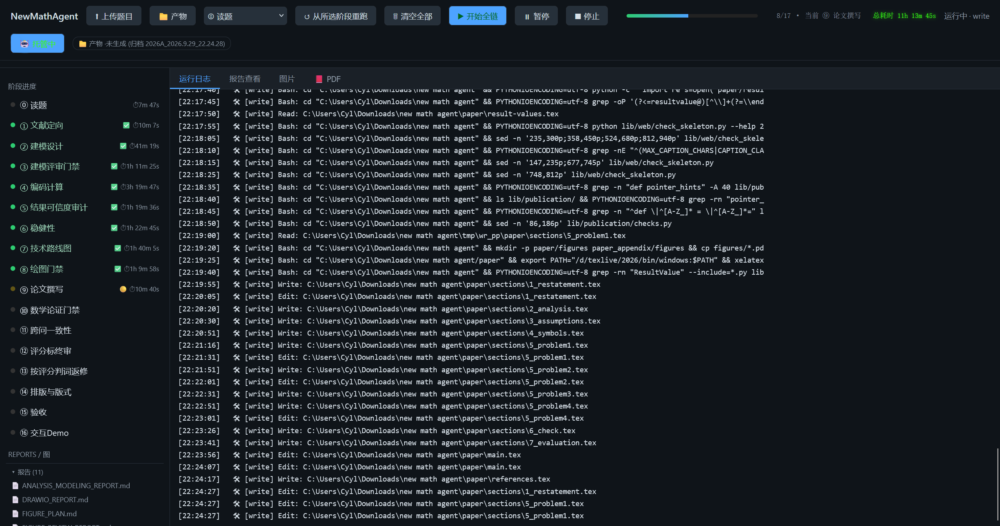

# NewMathAgent

数学建模竞赛的全自动写作 Agent。它把「读题 → 建模设计 → 编码计算 → 论文撰写 → 排版验收」整条链路
拆成 17 个阶段，每个阶段由一个独立的 skill 驱动，并在关键位置插入评审门禁。

> **当前状态：可运行 Demo。**
> 链路能端到端跑通四问建模题，产出正文 PDF、附录 PDF 与一个可离线打开的交互式 Demo。



面板左侧是 17 个阶段的进度与逐阶段耗时，右侧是各阶段的实时运行日志。顶栏可以上传赛题、从任意阶段重跑、
暂停或停止；门禁不过会亮黄灯等人决策。上面这张是一次完整跑链的实况：四问题、总耗时 11 小时 13 分。

## 它会产出什么

一条链跑到底，工作区里会有：

- `正文.pdf`、`附录A.pdf` —— 按国赛模板排版的成稿，两个独立工程分别编译；
- `result1.xlsx` … —— 各问结果表；
- `demo.html` —— 单文件离线交互页，双击即用，可现场试算；
- `其余文件/` —— 论文 LaTeX 源码、各阶段报告、画图脚本；
- `运行说明.md` —— 提交件清单。

提交件统一收在 `产物/提交作品/最新作品/`，可以直接打包提交。

## 当前能力

- **17 阶段链**：题目读取、文献定向、建模设计、建模评审门禁、编码计算、结果可信度审计、稳健性、
  技术路线图、绘图门禁、论文撰写、数学论证门禁、跨问一致性、评分标终审、按评分判词返修、
  排版与版式、验收、交互 Demo。顺序与职责见 `docs/STAGE_CHAIN.md`。
- **人工检查点**：⓪ 读完题会停下等你核对（左栏原 PDF、右栏渲染后的题面），确认后才往下跑；
  门禁不过或阶段超时会亮黄灯，由你选择重试、回退、延长或接受并披露。
- **评审门禁**：建模评审、数学论证、跨问一致性、评分标终审各用独立子 agent 分维度审，
  不通过就不放行。措辞类判词就地改写，不回退重写整篇。
- **网页驱动面板**：上传赛题、看阶段进度与运行日志、在黄灯上做决策，也可以一键托管。
- **提交件打包**：收口时按白名单打成提交形状，清单逐项对账。
- **回归套件**：600 余条用例，覆盖驱动、门禁、交付、排版与前端。

## 在一台新电脑上运行

按顺序做这几步即可。仓库里的路径都相对于项目根目录，不依赖任何本机绝对路径。

### 1. 安装基础环境

- Claude Code（必要）。整个项目都是驱动 shell 出去跑一次 `claude -p`，没有它运行不了。
  装 VSCode 或 Cursor 的 Claude Code 扩展或装在 PATH 里的独立 CLI；
- Python 3.11 或更高版本；
- XeLaTeX（论文编译，必需）；
- Poppler（PDF 逐页转图，验收阶段用，必需）；
- Pandoc、draw.io desktop（导出与画图，可选，缺了只是对应功能不可用）。

驱动会自己去找 `claude`：先看 `.env` 里的 `WEBDRIVER_CLAUDE`，再扫 `~/.vscode/extensions`、
`~/.vscode-server/extensions`、`~/.vscode-insiders/extensions`、`~/.cursor/extensions`（取最新的
那个版本），最后回退 PATH。装在别处就在 `.env` 里写 `WEBDRIVER_CLAUDE=<完整路径>`。
装完跑 `python runtime/doctor.py` 核对，它会把这几个依赖逐个报出来。

### 2. 安装依赖

```bash
pip install -r requirements.txt
```

要精确复现开发时测过的版本，改用 `requirements.lock.txt`。装完可以核对：

```bash
python runtime/doctor.py
```

它会实际导入每一个包，并把缺失项与外部工具逐个报出来。

### 3. 指明本机的解释器与工具目录

把 `config/runtime.local.json.example` 复制成 `config/runtime.local.json`，填两项：

- `python`：项目专用解释器的完整路径（建议为本项目单独建一个 venv，不要用系统 Python）；
- `tool_directories`：XeLaTeX、Pandoc、draw.io 的 bin 目录，启动时只拼进本进程的 PATH。

这份文件只影响本机，不随仓库分发。

### 4. 模型配置

把 `.env.example` 复制成 `.env`，填三个键：

```dotenv
ANTHROPIC_BASE_URL=https://api.deepseek.com/anthropic
ANTHROPIC_AUTH_TOKEN=your-api-key
ANTHROPIC_MODEL=deepseek-flash[1M]
```

端点和模型名填服务商给的即可，两者必须配套。`.env` 里会有密钥，不要整个目录打包外发；
要分享就发不带值的 `.env.example`。

### 5. 启动

双击项目根目录的 `run.bat`。它会起 Web 驱动、等它就绪，然后自动打开前端面板
（已经在跑就只开面板，不会起第二个）。命令行精细控制用 `run.ps1`：

```powershell
.\run.ps1                              # 只读检查依赖
.\run.ps1 lib/web/server.py --port 8901
.\run.ps1 -m unittest discover -s regression -v
```

### 6. 上传赛题

在面板顶栏点「⬆ 上传题目」选择整个赛题文件夹（题面、附件、数据一起），或把文件夹拖进高亮区。
⓪ 读题会先读一遍并停下让你核对，确认后才从 ① 起跑。

## 目录结构

| 位置 | 是什么 |
|---|---|
| `lib/web/` | 驱动本体（`python lib/web/server.py`）、门禁、前端 `lib/web/static/` |
| `lib/delivery/` | 把工作区打包成提交形状（`python -m lib.delivery package\|check\|report`） |
| `lib/publication/` | 页数与版式检查（`python -m lib.publication check`） |
| `lib/visualization/` | 画图库与图证据（`python -m lib.visualization audit`） |
| `lib/result_contract/` | 结果契约（`python -m lib.result_contract build\|audit`） |
| `skills/` | 17 个阶段 skill，顺序见 `docs/STAGE_CHAIN.md` |
| `runtime/` | 入口脚本与运行期状态：`launch.py`、`doctor.py`、`quality/` 回执、`web_run.log` |
| `regression/` | 缺陷拦截回归样例，干净检出上应全绿 |
| `request/` `data/` | 赛题输入。会被哈希进阶段指纹，跑起来之后不要再动 |
| `产物/` | 输出与归档：`各阶段产物/最新产物`、`提交作品/最新作品` |
| `config/` `docs/` | 阈值配置与说明文档 |
| `.env` | 模型 API 与出站代理配置 |

## 说明

- 阶段的产物落在 `产物/` 下，路径可以在面板里改。
- 换题时两个「最新」目录会整目录改名成 `<题目标识_日期_时间>/` 归档，同一题反复重跑不用清理。
- 外部工具不是 pip 包，装不到 Python 环境里：论文编译要 XeLaTeX，逐页目视要 Poppler 的 `pdftoppm`。
- 驱动默认把 API 端点摘出系统代理；需要改动见 `.env.example`。
